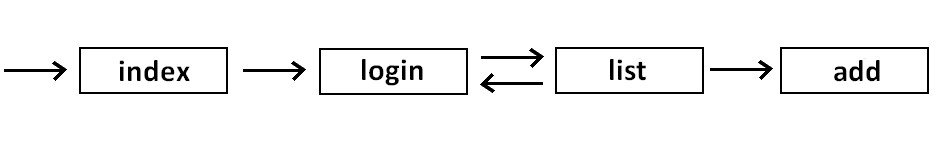
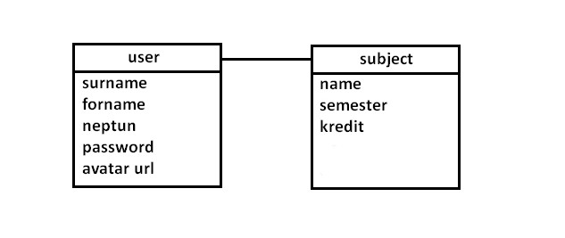

# Beadandó

Tantárgyak felvétele/tárolása

##Követelményanalízis

- Funkcionális elvárások
 - regisztráció
 - bejelentkezés
 - tantárgyak felvétele(név,ajánlott félév,kredit)
 - tantárgyak tárolása
 - tantárgyak törlése
- Használati esetmodell
 - Szerepkörök
   - Felhasználó: (felvehet, listázhat, törölhet tárgyakat)
 - Használati eset diagram:
 
 
 - Folyamatok pontos menete:
   - bejelentkezés vagy regisztráció, ezután a felhasználó használhatja az oldal funkcióit, a hozzáadásra kattintás után, a már hozzáadott tárgyakat listázhatja, ha a listázásra kattint.

##Tervezés

###Oldaltérkép

 - Főoldal
  - Bejelentkezés
  - Regisztráció

 - Főoldal (bejelentkezve)
  - Elemek listázása
  - Új elem felvétele
  - Információ az alkalmazásról
  - Kijelentkezés

###Végpontok

###Osztálymodell

###Megjelenés

##Implementáció

###Fejlesztői környezet
- c9.io (online IDE, node.js)

###Könyvtárstruktúrában lévő mappák funkiójának bemutatása
- \ főkönyvtár
- \models: osztálymodellek
- \node_modules: bizonyos funkciókhoz szükséges node.js modulok
- \views: megjelenéshez szükséges fájlok

##Tesztelés

##Felhasználói dokumentáció

- A program futtattásához egy böngésző program szükséges, pl. Google Chrome, Opera, Firefox
- A program használata: Miután megnyitottuk a programokat, be kell jelentkeznünk, ha ezt még korábban nem tettük meg, akkor regisztrálnunk kell. Ha ez megtörtént, akkor az oldal füleire kattintva érhetjük el a funkcióit( listázás, hozzáadás). 

